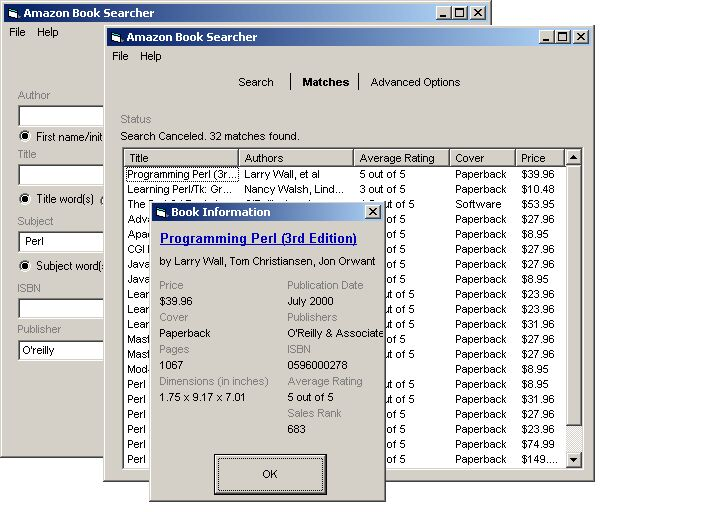



## Amazon Book Searcher

### Description

The Amazon Book Searcher lets you search for books available on the Amazon.com website. You can search for books by their Title, Author, Subject, ISBN, Publisher, Format (Hardcover, Paperback and etc), Reader Age, Language and Publication Date. In addition to the book's Title, Author and Average Rating, the program can also retrieve the book's Price, Cover type,Number of Pages, Dimensions, Publishers, ISBN and Sales Rank by checking the "Retrieve Book's Additional Information" checkbox in the Advanced Options Tab. With the Amazon Book Searcher, you can also save the books you found and edit them later. This program can also connect to the net for you if you're not connected while searching. This code is well commented, and I'm almost sure this program is 100% bug-free.
 
### More Info
 

             |
---                |---
**Submitted On**   |2001-02-02 12:54:14
**By**             |[Yaron Budowski](https://github.com/Planet-Source-Code/PSCIndex/blob/master/ByAuthor/yaron-budowski.md)
**Level**          |Advanced
**User Rating**    |4.8 (48 globes from 10 users)
**Compatibility**  |VB 6\.0
**Category**       |[Internet/ HTML](https://github.com/Planet-Source-Code/PSCIndex/blob/master/ByCategory/internet-html__1-34.md)
**World**          |[Visual Basic](https://github.com/Planet-Source-Code/PSCIndex/blob/master/ByWorld/visual-basic.md)
**Archive File**   |[CODE\_UPLOAD14417222001\.zip](https://github.com/Planet-Source-Code/yaron-budowski-amazon-book-searcher__1-14919/archive/master.zip)

